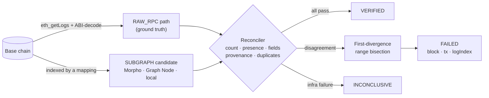

# Lute

[](https://github.com/Stella112/Lute/actions/workflows/ci.yml)

**Independent verification of a Subgraph index against raw blockchain data.**

Lute reconstructs event facts **directly from Base RPC logs** and compares them to the
**same events as reported by an independent index**. If the index's mapping is wrong,
Lute catches it — because Lute's expected values never come from the mapping.

Proven on real Base data against **both** a public index (Morpho) **and** a self-hosted
**Graph Node** running real AssemblyScript mappings:

```
HONEST   RAW_RPC = 75   SUBGRAPH = 75   → VERIFIED
BUGGED   RAW_RPC = 75   SUBGRAPH = 74   → FAILED
         first divergence: block 51120808 · tx 0x443364da…82260 · logIndex 496
```

Every number is discovered at runtime. None is hard-coded in the verifier.

## How it works



The verifier reconstructs the left path from raw logs and only ever *compares* the right
path — so a bug in the candidate's mapping cannot hide in the expected values.

Surfaces over the same engine: a **CLI**, an **MCP server** (`lute_audit`), a **watchlist
runner**, a **dashboard**, and a deterministic **plain-English** explainer.

---

## The two paths (physically separate)

| | RAW_RPC (verifier / ground truth) | SUBGRAPH (candidate under audit) |
|---|---|---|
| code | `src/rpc.ts`, `src/abi.ts`, `src/canonical.ts` | `morpho.ts` (public index) · `graphNode.ts` (real Graph Node) · `substreams.ts` (Pinax stream) · `localMapping.ts` (controlled) |
| how facts are derived | `eth_getLogs` → ABI-decode the raw log | queried from an index built by someone else's mapping |
| topic0 | `keccak256("Deposit(address,address,uint256,uint256)")`, asserted to equal the emitted topic | n/a |

The verifier **never** imports the candidate's mapping, and never adopts a value it
observed from the candidate. Before each check we ask: *if the mapping had a bug in
this computation, would the verifier still independently obtain the correct expected
value?* If not, it is not a valid check.

---

## Run it

```bash
npm install

# HONEST — audit the real Morpho index against raw Base RPC
npm run lute -- audit --network base \
  --contract 0xbeeF010f9cb27031ad51e3333f9aF9C6B1228183 \
  --subgraph morpho --event Deposit \
  --from-block 51115000 --to-block 51125000

# BUGGED — same verifier, unchanged, against a mapping with a planted entity-id bug
npm run lute -- audit --network base \
  --contract 0xbeeF010f9cb27031ad51e3333f9aF9C6B1228183 \
  --subgraph local:block-id --event Deposit \
  --from-block 51115000 --to-block 51125000
```

Add `--json` for machine-readable output. Exit codes: `0` VERIFIED, `2` FAILED,
`3` INCONCLUSIVE. The verifier RPC URL is read from `BASE_RPC_VERIFIER` (only the
alias is ever logged); it defaults to the public archive endpoint `mainnet.base.org`.

```bash
npm test          # 19 unit + negative tests (offline)
npm run test:live # honest real-vault audit (network)
npm run test:bugged # controlled bugged divergence (network)
```

---

## Phase 2 — MCP server

The verified reconciler is exposed as agent-callable tools over stdio ([`src/mcp.ts`](src/mcp.ts)),
reusing the Phase 1 engine unchanged.

- `lute_audit(network, contract, event, fromBlock, toBlock, subgraph)` → the machine-readable
  `AuditReport` (verdict + checks + evidence + `firstDivergence`).
- `lute_supported_events()` → the ERC-4626 events with signature and `keccak256`-derived `topic0` (offline).

Run standalone: `npm run mcp`. Register it in an MCP client with
[`mcp.config.example.json`](mcp.config.example.json) (Claude Code: add the `mcpServers`
entry to `.mcp.json`, using an absolute path to `src/mcp.ts`). MCP speaks JSON-RPC on
stdout; all Lute logging goes to stderr, so the protocol stream is never corrupted.

```bash
npm run test:mcp  # spawns the server and drives it as a real MCP client (network)
```

Verified end-to-end over MCP: `lute_audit` returns VERIFIED (75==75) for the real Morpho
index and FAILED (75 vs 74, first divergence block 51120808) for the bugged mapping —
the same results as the CLI, through the protocol.

---

## Phase 3 — Operating a watchlist

`lute watch` audits a list of targets, isolates per-target failures, and rolls up to a
single status a scheduler / CI job can act on ([`src/runner.ts`](src/runner.ts)).

```bash
npm run lute -- watch --config lute.targets.example.json   # add --json for machine output
```

Exit codes: `0` all VERIFIED · `2` any FAILED · `3` any INCONCLUSIVE (no FAILED). Every
non-VERIFIED target emits a structured `alert.target` line on stderr, and if `WEBHOOK_URL`
is set the batch **posts a summary to Slack/Discord/any webhook** (Slack/generic get
`{text}`, Discord gets `{content}`). A target's `subgraph` can be
`graphnode:lute/steak-honest` to watch a real Graph Node (needs `GRAPH_NODE_URL`).
Schedule it with OS cron or the Claude Code `/schedule` routine — the runner is the unit
of work; scheduling just invokes it.

Live proof over the example watchlist (real Base data):

```
  steak-usdc-deposits                 VERIFIED  raw=75  sub=75
  steak-usdc-withdraws                VERIFIED  raw=109 sub=109
  steak-usdc-deposits-BUGGED-mapping  FAILED    first divergence @ block 51120808
Summary: 2 VERIFIED, 1 FAILED, 0 INCONCLUSIVE (of 3)  ->  BATCH VERDICT: FAILED (exit 2)
```

---

## Phase 4 — Dashboard

A tiny local server ([`src/server.ts`](src/server.ts)) runs the **real** audit engine and
serves a single-page UI ([`public/index.html`](public/index.html)) — the browser only ever
talks to this local server (same-origin, no CORS); all RPC/Subgraph traffic is server-side.

```bash
npm run dashboard   # http://localhost:8788  (PORT env to override)
```

Pick a vault, event, block range and index (`morpho`, `substreams`, or a `local:<bug>` mapping), hit
**Run audit**, and see the verdict badge, RAW vs SUBGRAPH counts, the checks table, the
first-divergence panel, and full provenance. Endpoints: `POST /api/audit` (returns the
`AuditReport` JSON) and `GET /api/events`. No reimplementation — the UI is a thin view
over the same engine the CLI and MCP server use. Verified live in-browser: `morpho` →
VERIFIED (75/75), `local:block-id` → FAILED (75/74, first divergence block 51120808).

For an independent streaming candidate, set `SUBSTREAMS_API_TOKEN` in the ignored
`.env` and use `--subgraph substreams`. Lute consumes Pinax's pinned public
ERC-4626 `map_events` package, filters it to the requested vault, and still
reconstructs the expected result independently from raw Base RPC logs. Override
the endpoint, package, or module with `SUBSTREAMS_ENDPOINT`, `SUBSTREAMS_PACKAGE`,
or `SUBSTREAMS_MODULE`.

---

## Phase 5 — Natural-language explanations

A **deterministic** generator ([`src/explain.ts`](src/explain.ts)) turns an `AuditReport`
into plain English — a pure function of the report's fields, no model call and no
fabrication, so the prose is exactly as trustworthy as the report.

```bash
npm run lute -- audit --contract 0x... --event Deposit --from-block N --to-block N --explain
npm run lute -- explain --file evidence_bugged.json      # explain a saved report
```

Also exposed as the MCP tool `lute_explain(report)` and folded into the watch runner's
`alert.target` line as a one-line `summary`. Example, from the real bugged run:

<!-- phase-5-example -->

## Phase 6 — Real Graph Node (self-hosted subgraph + VPS)

The `local:*` sources simulate a mapping; this stage runs the real thing. Under
[`subgraph/`](subgraph/) is an actual Graph-protocol subgraph indexing the Steakhouse
vault's Deposit/Withdraw, in two builds:

- [`src/mapping.ts`](subgraph/src/mapping.ts) — honest (id = `txHash-logIndex`)
- [`src/mapping.bugged.ts`](subgraph/src/mapping.bugged.ts) — planted bug (id = `block.number`, so same-block events collide and one is lost)

Both **compile to WASM** with `graph build` (verified locally). [`src/subgraph/graphNode.ts`](src/subgraph/graphNode.ts)
adds a `GraphNodeSource` so Lute audits a live graph-node's GraphQL endpoint — and
because this subgraph exposes the address fields, `field_accuracy:sender/owner/receiver`
become VERIFIED too (they're UNVERIFIED against Morpho).

```bash
lute audit ... --subgraph graphnode:lute/steak-honest   # expect VERIFIED 75==75
lute audit ... --subgraph graphnode:lute/steak-bugged   # expect FAILED 75 vs 74 @ 51120808
```

Standing up graph-node needs Docker, so it runs on a Linux VPS via
[`deploy/docker-compose.yml`](deploy/docker-compose.yml) (graph-node + postgres + ipfs +
the Lute app). Full walkthrough: [`deploy/README.md`](deploy/README.md). The **same
unchanged verifier** should VERIFY the honest deployment and FAIL the bugged one against
a real Graph Node — the last Phase 1 caveat closed.

> ✅ **Executed end-to-end on a real Graph Node** (graph-node v0.37 + postgres + ipfs on
> a Linux VPS). Both subgraphs were deployed and indexed; the unchanged verifier was run
> against each over `[51115000, 51121000]` (range trimmed from 51125000 only to speed
> sync on a public RPC — the collision block is unchanged):
>
> ```
> HONEST  graphnode:lute/steak-honest   RAW_RPC = 49  SUBGRAPH = 49  VERIFIED
>         every check PASS — incl. field_accuracy:sender/owner (this subgraph exposes them)
> BUGGED  graphnode:lute/steak-bugged   RAW_RPC = 49  SUBGRAPH = 48  FAILED
>         first divergence: block 51120808, tx 0x443364da…82260, logIndex 496 (missing)
> ```
>
> The planted `id = block.number` bug in the deployed WASM collapsed block 51,120,808's
> two deposits into one; the independent verifier caught the missing event and bisected
> to it. Evidence: [`evidence_graphnode_honest.json`](evidence_graphnode_honest.json),
> [`evidence_graphnode_bugged.json`](evidence_graphnode_bugged.json).

Example, from the real bugged `local` run (same shape the Graph Node run will produce):

> Audit … — FAILED. Over Base blocks 51115000–51125000, the raw chain has 75 Deposit
> event(s) but local-mapping://block-id reported 74. The following check(s) failed:
> event_count and event_presence. … The earliest divergence is at block 51120808,
> transaction 0x443364…82260, log index 496. That Deposit event is present on-chain but
> missing from the index (failed check: event_presence). This exact block, transaction
> and log were discovered by range bisection during the run — none was known in advance.

---

## VAULT VALIDATION

```
network:            Base (chainId 8453)
contract:           0xbeeF010f9cb27031ad51e3333f9aF9C6B1228183  (Steakhouse USDC / "steakUSDC")
contract standard:  ERC-4626 (MetaMorpho, OZ ERC4626 base)
                    confirmed on-chain: asset()=0x833589fcd6edb6e08f4c7c32d4f71b54bda02913 (Base USDC),
                    totalAssets()=132619496922066, decimals()=18
ABI source:         event signatures confirmed from actual emitted logs (topic0 == keccak256(signature))

Deposit signature:  Deposit(address indexed sender, address indexed owner, uint256 assets, uint256 shares)
Deposit topic0:     0xdcbc1c05240f31ff3ad067ef1ee35ce4997762752e3a095284754544f4c709d7

Withdraw signature: Withdraw(address indexed sender, address indexed receiver, address indexed owner, uint256 assets, uint256 shares)
Withdraw topic0:    0xfbde797d201c681b91056529119e0b02407c7bb96a4a2c75c01fc9667232c8db

Subgraph:           https://api.morpho.org/graphql   (Morpho public GraphQL indexer)
                    An independent, externally-operated index Lute does not control and
                    shares no mapping code with. Used as the honest audit's candidate.
Entity used:        vaultV1Transactions
Fields available:   txHash, blockNumber, txIndex, logIndex, type (Deposit/Withdraw), assets, shares
                    (sender/owner/receiver are NOT exposed -> those field checks report UNVERIFIED)

Candidate range:    51115000 -> 51125000   (Deposit demo)
Events in range:    Deposit  = 75   (RAW_RPC == Morpho)
                    Withdraw = 109 over [51100000, 51110000] (RAW_RPC == Morpho), used for the Withdraw demo
Safe head basis:    chain head ~51,142,300 at run time; range end is ~17.3k blocks
                    (~9.6h at 2s/block) behind head -> final, reorg-safe
eth_getLogs limit:  provider caps ranges at 2000 blocks; the reader chunks accordingly

TARGET STATUS:      VALID
```

### Why this yields a clean N vs N−1

Within `[51115000, 51125000]` exactly one block (**51120808**) contains two Deposit
events, in two different transactions (logIndex 496 and 523). Both are real; both are
in the raw logs and in Morpho's index. The controlled bug is a classic mapping mistake:

> `LocalMappingSource` with `bug="block-id"` uses `event.block.number` as the entity id
> instead of `txHash + logIndex`.

Two events in one block collide; `store.set` keeps the last write (logIndex 523) and
silently drops the first (logIndex 496). Indexed count becomes 74. The verifier — a
general rule that every raw `(txHash, logIndex)` must be indexed exactly once — flags
the missing event and the bisection engine locates block 51120808 with no prior
knowledge of it.

---

## x402 — pay-per-audit

Lute's audit is also served as an [x402](https://github.com/coinbase/x402)-gated HTTP
endpoint ([`src/x402-server.ts`](src/x402-server.ts)): a request without a valid
`X-PAYMENT` header gets `HTTP 402` + payment requirements; a paid request is verified and
settled via an x402 facilitator, then the audit runs and returns with an
`X-PAYMENT-RESPONSE` header. Lute never moves funds — the client signs, the facilitator
settles to `payTo`.

```bash
X402_PAY_TO=0xYourAddress X402_NETWORK=base-sepolia npm run x402   # :8789
# POST /audit  (no payment) -> 402 { x402Version, accepts: [ { scheme:"exact", ... } ] }
# POST /audit  (X-PAYMENT header) -> verify -> run audit -> settle -> 200 + report
```

Config via env: `X402_PAY_TO` (required), `X402_PRICE` (default `$0.01`), `X402_NETWORK`
(`base-sepolia` default / `base`), `X402_FACILITATOR_URL`. Verified offline: requirements
validate against the x402 schema and the 402 challenge is protocol-correct; the paid path
needs a funded client to exercise.

## Hedera attestations

Each verdict can be published to **Hedera Consensus Service** as an immutable, timestamped
attestation ([`src/hedera.ts`](src/hedera.ts)) — a compact `{verdict, contract, event,
range, counts, firstDivergence, runId, ts}` message on an HCS topic.

```bash
# credentials in .env (gitignored): HEDERA_OPERATOR_ID, HEDERA_OPERATOR_KEY, HEDERA_NETWORK
node --env-file=.env --import tsx src/cli.ts audit --contract 0x... --event Deposit \
  --from-block N --to-block N --attest          # audit, then attest the verdict
node --env-file=.env --import tsx src/cli.ts attest --file report.json   # attest a saved report
```

Returns the topic id, sequence number, transaction id, and a HashScan link. The payload
builder is offline-tested; the live HCS submit needs a (free) testnet operator account —
Lute never logs the key.

## Hedera x402 paid verification

The qualifying Hedera path is a separate x402 v2 service in
[`src/paid/server.ts`](src/paid/server.ts). It advertises a native-HBAR requirement,
discovers the Hedera fee payer from Blocky402's `/supported` endpoint, verifies and
settles the payment through Blocky402, then runs the real Lute reconciler and returns
the complete audit report. The demo consumer in [`src/paid/agent.ts`](src/paid/agent.ts)
uses `@x402/fetch` to handle the 402 → sign → retry flow.

```bash
# Set HEDERA_OPERATOR_ID and HEDERA_OPERATOR_KEY in a local, ignored .env first.
node --env-file=.env --import tsx src/paid/server.ts
# In another terminal, with a funded Hedera testnet payer:
node --env-file=.env --import tsx src/paid/agent.ts
```

Set `PAID_PUBLIC_URL` to the externally reachable HTTPS origin when running behind a
proxy; it is part of the signed x402 resource requirement. The endpoint bounds request
body size and block-range span, rejects caller-supplied graph-node URLs, and returns a
400/413 for invalid requests before asking Blocky402 to verify payment. A real paid
request still requires a funded testnet payer and should be recorded separately in
[`docs/judging/evidence.md`](docs/judging/evidence.md); tests do not pretend to settle
payments.

## Checks implemented

`event_count`, `event_presence` (bidirectional: missing + phantom), `transaction_provenance`,
`block_provenance`, `duplicate_detection`, and per-field `field_accuracy` (`assets`,
`shares` verified against RAW; `sender`/`owner`/`receiver` reported UNVERIFIED because
Morpho does not expose them). A field the index does not expose is never silently
passed or failed.

`VERIFIED` requires count + presence to PASS, no STRONG check to FAIL, **and** at least
one field to have been independently verified — so an index that exposes nothing can
never be VERIFIED. Any infrastructure failure (an unretrievable RPC chunk, a failed
Subgraph page, malformed data) is **INCONCLUSIVE**, never VERIFIED.

**Reorg safety.** A range past chain head is INCONCLUSIVE; with `--min-confirmations N`
(CLI) or `minConfirmations` (engine/MCP), a range end nearer than `N` blocks to head is
also INCONCLUSIVE rather than audited on reorg-prone data.

**Not overfit to one vault.** The same engine was validated on a second, unrelated Base
MetaMorpho vault — Gauntlet USDC Prime (`0xeE8F4eC5672F09119b96Ab6fB59C27E1b7e44b61`):
honest `morpho` → VERIFIED (71 == 71); a `swap-fields` mapping bug → FAILED, caught by
`field_accuracy:assets` at block 51120116 (raw `assets=400000000` vs the index's swapped
`shares` value). Different vault, different bug class, different failing check — same
unchanged verifier.

---

## Evidence files

- [`evidence_honest.json`](evidence_honest.json) — full machine-readable VERIFIED verdict
- [`evidence_bugged.json`](evidence_bugged.json) — full machine-readable FAILED verdict with `firstDivergence`
- [`SELF_AUDIT.md`](SELF_AUDIT.md) — the mandatory Phase 1 self-audit, filled with real results

## Scope

The verifier, MCP, watch runner, dashboard, HCS attestation, candidate hashing/gate,
real Graph Node path, generic x402 path, and the Blocky402/Hedera paid-service code are
implemented. The honest Lute subgraph is deployed to Graph Studio on Base and has been
smoke-queried successfully. AI build/repair orchestration, continuous incident
persistence, and a recorded real paid Hedera request remain separate demo/production
work and must not be presented as complete until their evidence is collected.
